# IELTS Nexus — Database Schema (PostgreSQL on Supabase)

This document describes the complete database design for IELTS Nexus. The database is hosted on **Supabase** (managed PostgreSQL). All tables include Row Level Security (RLS) policies.

---

## Table of Contents

1. [Users & Authentication](#1-users--authentication)
2. [User Profiles](#2-user-profiles)
3. [Subscriptions & Credits](#3-subscriptions--credits)
4. [Topics](#4-topics)
5. [Writing Submissions](#5-writing-submissions)
6. [Speaking Submissions](#6-speaking-submissions)
7. [Exam Simulations](#7-exam-simulations)
8. [Grammar Practice](#8-grammar-practice)
9. [AI Feedback](#9-ai-feedback)
10. [Human Reviews](#10-human-reviews)
11. [Community Posts](#11-community-posts)
12. [Comments](#12-comments)
13. [Likes & Saves](#13-likes--saves)
14. [Weaknesses](#14-weaknesses)
15. [Badges & Achievements](#15-badges--achievements)
16. [Study Streaks](#16-study-streaks)
17. [Score History](#17-score-history)
18. [ER Diagram](#er-diagram)

---

## 1. Users & Authentication

Supabase Auth handles user registration, login, and JWT issuance. The `auth.users` table is managed by Supabase. We extend it with a `profiles` table.

> **Note**: Do NOT create a custom users table. Use `auth.users` from Supabase and reference `auth.users.id` as the foreign key.

---

## 2. User Profiles

```sql
CREATE TABLE profiles (
  id UUID PRIMARY KEY REFERENCES auth.users(id) ON DELETE CASCADE,
  name TEXT NOT NULL,
  email TEXT NOT NULL,
  avatar_url TEXT,
  goal_score DECIMAL(2,1) NOT NULL DEFAULT 7.0,  -- 6.0 to 9.0
  exam_reason TEXT NOT NULL DEFAULT 'university', -- university | job | immigration | professional
  current_level TEXT NOT NULL DEFAULT 'intermediate', -- beginner | intermediate | advanced
  target_date DATE,
  tier TEXT NOT NULL DEFAULT 'free',  -- free | premium
  created_at TIMESTAMPTZ NOT NULL DEFAULT NOW(),
  updated_at TIMESTAMPTZ NOT NULL DEFAULT NOW()
);

-- Index for quick lookups
CREATE INDEX idx_profiles_tier ON profiles(tier);
CREATE INDEX idx_profiles_email ON profiles(email);
```

**RLS Policy**:
```sql
ALTER TABLE profiles ENABLE ROW LEVEL SECURITY;

-- Users can read their own profile
CREATE POLICY "Users can view own profile" ON profiles
  FOR SELECT USING (auth.uid() = id);

-- Users can update their own profile
CREATE POLICY "Users can update own profile" ON profiles
  FOR UPDATE USING (auth.uid() = id);

-- Users can insert their own profile on signup
CREATE POLICY "Users can insert own profile" ON profiles
  FOR INSERT WITH CHECK (auth.uid() = id);
```

---

## 3. Subscriptions & Credits

```sql
CREATE TABLE subscriptions (
  id UUID PRIMARY KEY DEFAULT gen_random_uuid(),
  user_id UUID NOT NULL REFERENCES profiles(id) ON DELETE CASCADE,
  stripe_customer_id TEXT,
  stripe_subscription_id TEXT,
  plan TEXT NOT NULL DEFAULT 'free',  -- free | premium
  status TEXT NOT NULL DEFAULT 'active', -- active | cancelled | past_due
  current_period_start TIMESTAMPTZ,
  current_period_end TIMESTAMPTZ,
  created_at TIMESTAMPTZ NOT NULL DEFAULT NOW(),
  updated_at TIMESTAMPTZ NOT NULL DEFAULT NOW()
);

CREATE TABLE credits (
  id UUID PRIMARY KEY DEFAULT gen_random_uuid(),
  user_id UUID NOT NULL REFERENCES profiles(id) ON DELETE CASCADE,
  balance INTEGER NOT NULL DEFAULT 0,  -- current available credits
  updated_at TIMESTAMPTZ NOT NULL DEFAULT NOW()
);

CREATE TABLE credit_transactions (
  id UUID PRIMARY KEY DEFAULT gen_random_uuid(),
  user_id UUID NOT NULL REFERENCES profiles(id) ON DELETE CASCADE,
  amount INTEGER NOT NULL,  -- positive = add, negative = spend
  type TEXT NOT NULL,  -- purchase | monthly_grant | spend_writing | spend_speaking | spend_exam
  description TEXT,
  stripe_payment_id TEXT,  -- null for monthly grant or spend
  created_at TIMESTAMPTZ NOT NULL DEFAULT NOW()
);

CREATE INDEX idx_credits_user ON credits(user_id);
CREATE INDEX idx_credit_transactions_user ON credit_transactions(user_id);
CREATE INDEX idx_subscriptions_user ON subscriptions(user_id);
```

**Credit Pricing**:
- 1 credit = 1 writing or 1 speaking human review
- 4 credits = 1 full exam human review
- Price: $9.99 per credit (individual purchase)
- Premium plan includes 5 credits/month

---

## 4. Topics

```sql
CREATE TABLE topics (
  id TEXT PRIMARY KEY,  -- e.g., 'environment', 'education'
  name TEXT NOT NULL,
  emoji TEXT NOT NULL,
  frequency TEXT NOT NULL DEFAULT 'Medium', -- High | Medium | Low
  category TEXT, -- optional grouping
  created_at TIMESTAMPTZ NOT NULL DEFAULT NOW()
);


-- Seed data
INSERT INTO topics (id, name, emoji, frequency) VALUES
  ('environment', 'Environment', '🌍', 'High'),
  ('education', 'Education', '🎓', 'High'),
  ('technology', 'Technology', '💻', 'High'),
  ('health', 'Health & Fitness', '🏥', 'Medium'),
  ('work', 'Work & Career', '💼', 'High'),
  ('travel', 'Travel & Tourism', '✈️', 'Medium'),
  ('family', 'Family & Society', '👨‍👩‍👧', 'High'),
  ('media', 'Media & Culture', '📱', 'Medium'),
  ('sport', 'Sports', '⚽', 'Low'),
  ('food', 'Food & Nutrition', '🍎', 'Low'),
  ('globalization', 'Globalization', '🌐', 'High'),
  ('housing', 'Housing', '🏠', 'Medium');
```

---

## 5. Writing Submissions

```sql
CREATE TABLE writing_submissions (
  id UUID PRIMARY KEY DEFAULT gen_random_uuid(),
  user_id UUID NOT NULL REFERENCES profiles(id) ON DELETE CASCADE,
  topic_id TEXT REFERENCES topics(id),
  exam_simulation_id UUID REFERENCES exam_simulations(id), -- null if standalone

  -- Task 1
  task1_prompt TEXT NOT NULL,
  task1_text TEXT NOT NULL,
  task1_word_count INTEGER NOT NULL DEFAULT 0,

  -- Task 2
  task2_prompt TEXT NOT NULL,
  task2_text TEXT NOT NULL,
  task2_word_count INTEGER NOT NULL DEFAULT 0,

  time_spent_seconds INTEGER, -- total seconds used
  review_type TEXT, -- ai | human | both
  status TEXT NOT NULL DEFAULT 'submitted', -- submitted | ai_reviewed | human_reviewed | completed

  created_at TIMESTAMPTZ NOT NULL DEFAULT NOW(),
  updated_at TIMESTAMPTZ NOT NULL DEFAULT NOW()
);

CREATE INDEX idx_writing_user ON writing_submissions(user_id);
CREATE INDEX idx_writing_status ON writing_submissions(status);
```

---

## 6. Speaking Submissions

```sql
CREATE TABLE speaking_submissions (
  id UUID PRIMARY KEY DEFAULT gen_random_uuid(),
  user_id UUID NOT NULL REFERENCES profiles(id) ON DELETE CASCADE,
  topic_id TEXT REFERENCES topics(id),
  exam_simulation_id UUID REFERENCES exam_simulations(id),

  review_type TEXT, -- ai | human | both
  status TEXT NOT NULL DEFAULT 'submitted',

  created_at TIMESTAMPTZ NOT NULL DEFAULT NOW(),
  updated_at TIMESTAMPTZ NOT NULL DEFAULT NOW()
);

CREATE TABLE speaking_responses (
  id UUID PRIMARY KEY DEFAULT gen_random_uuid(),
  submission_id UUID NOT NULL REFERENCES speaking_submissions(id) ON DELETE CASCADE,
  question_index INTEGER NOT NULL, -- 0–9
  question_text TEXT NOT NULL,
  audio_url TEXT NOT NULL,  -- Supabase Storage path
  duration_seconds DECIMAL(5,1),
  transcript TEXT,  -- filled by Whisper API
  created_at TIMESTAMPTZ NOT NULL DEFAULT NOW()
);

CREATE INDEX idx_speaking_user ON speaking_submissions(user_id);
CREATE INDEX idx_speaking_responses_submission ON speaking_responses(submission_id);
```

---

## 7. Exam Simulations

```sql
CREATE TABLE exam_simulations (
  id UUID PRIMARY KEY DEFAULT gen_random_uuid(),
  user_id UUID NOT NULL REFERENCES profiles(id) ON DELETE CASCADE,

  -- Time tracking
  started_at TIMESTAMPTZ NOT NULL DEFAULT NOW(),
  completed_at TIMESTAMPTZ,
  total_duration_seconds INTEGER,

  -- Phase completion flags
  listening_completed BOOLEAN DEFAULT FALSE,
  reading_completed BOOLEAN DEFAULT FALSE,
  writing_completed BOOLEAN DEFAULT FALSE,
  speaking_completed BOOLEAN DEFAULT FALSE,

  -- Linked submissions for writing/speaking
  writing_submission_id UUID,
  speaking_submission_id UUID,

  review_type TEXT, -- ai | human | both
  status TEXT NOT NULL DEFAULT 'in_progress', -- in_progress | completed | ai_reviewed | human_reviewed

  created_at TIMESTAMPTZ NOT NULL DEFAULT NOW()
);

CREATE TABLE exam_listening_answers (
  id UUID PRIMARY KEY DEFAULT gen_random_uuid(),
  exam_id UUID NOT NULL REFERENCES exam_simulations(id) ON DELETE CASCADE,
  question_number INTEGER NOT NULL, -- 1–10
  selected_answer TEXT, -- A | B | C
  correct_answer TEXT,
  is_correct BOOLEAN,
  created_at TIMESTAMPTZ NOT NULL DEFAULT NOW()
);

CREATE TABLE exam_reading_answers (
  id UUID PRIMARY KEY DEFAULT gen_random_uuid(),
  exam_id UUID NOT NULL REFERENCES exam_simulations(id) ON DELETE CASCADE,
  question_number INTEGER NOT NULL, -- 1–10
  selected_answer TEXT, -- TRUE | FALSE | NOT GIVEN
  correct_answer TEXT,
  is_correct BOOLEAN,
  created_at TIMESTAMPTZ NOT NULL DEFAULT NOW()
);

CREATE INDEX idx_exam_user ON exam_simulations(user_id);
CREATE INDEX idx_listening_answers_exam ON exam_listening_answers(exam_id);
CREATE INDEX idx_reading_answers_exam ON exam_reading_answers(exam_id);
```

---

## 8. Grammar Practice

```sql
CREATE TABLE grammar_questions (
  id UUID PRIMARY KEY DEFAULT gen_random_uuid(),
  category TEXT NOT NULL, -- e.g., 'subject-verb-agreement'
  sentence TEXT NOT NULL,
  options JSONB NOT NULL, -- ["is", "are", "was", "were"]
  correct_answer_index INTEGER NOT NULL,
  explanation TEXT NOT NULL,
  difficulty TEXT NOT NULL DEFAULT 'medium', -- easy | medium | hard
  created_at TIMESTAMPTZ NOT NULL DEFAULT NOW()
);

CREATE TABLE grammar_sessions (
  id UUID PRIMARY KEY DEFAULT gen_random_uuid(),
  user_id UUID NOT NULL REFERENCES profiles(id) ON DELETE CASCADE,
  category TEXT NOT NULL,
  total_questions INTEGER NOT NULL,
  correct_answers INTEGER NOT NULL,
  score_percentage DECIMAL(5,2) NOT NULL,
  completed_at TIMESTAMPTZ NOT NULL DEFAULT NOW()
);

CREATE TABLE grammar_answers (
  id UUID PRIMARY KEY DEFAULT gen_random_uuid(),
  session_id UUID NOT NULL REFERENCES grammar_sessions(id) ON DELETE CASCADE,
  question_id UUID NOT NULL REFERENCES grammar_questions(id),
  selected_answer_index INTEGER NOT NULL,
  is_correct BOOLEAN NOT NULL,
  created_at TIMESTAMPTZ NOT NULL DEFAULT NOW()
);

CREATE INDEX idx_grammar_sessions_user ON grammar_sessions(user_id);
```

---

## 9. AI Feedback

```sql
CREATE TABLE ai_feedback (
  id UUID PRIMARY KEY DEFAULT gen_random_uuid(),
  user_id UUID NOT NULL REFERENCES profiles(id) ON DELETE CASCADE,

  -- Polymorphic reference (one of these will be set)
  writing_submission_id UUID REFERENCES writing_submissions(id),
  speaking_submission_id UUID REFERENCES speaking_submissions(id),
  exam_simulation_id UUID REFERENCES exam_simulations(id),

  feedback_type TEXT NOT NULL, -- writing | speaking | exam

  -- Scores (band scores 0.0–9.0)
  overall_score DECIMAL(2,1),
  
  -- Writing-specific scores
  task_achievement DECIMAL(2,1),
  coherence_cohesion DECIMAL(2,1),
  lexical_resource DECIMAL(2,1),
  grammatical_range DECIMAL(2,1),

  -- Speaking-specific scores
  fluency_coherence DECIMAL(2,1),
  pronunciation DECIMAL(2,1),
  speaking_lexical DECIMAL(2,1),
  speaking_grammatical DECIMAL(2,1),

  -- Listening / Reading scores (for exam)
  listening_score DECIMAL(2,1),
  reading_score DECIMAL(2,1),

  -- Detailed feedback stored as JSON
  corrections JSONB,  -- [{position, original, correction, type}]
  insights JSONB,     -- [{category, title, detail, severity}]
  suggestions JSONB,  -- [{text, priority}]

  raw_response JSONB, -- full Groq response for debugging

  created_at TIMESTAMPTZ NOT NULL DEFAULT NOW()
);

CREATE INDEX idx_ai_feedback_user ON ai_feedback(user_id);
CREATE INDEX idx_ai_feedback_writing ON ai_feedback(writing_submission_id);
CREATE INDEX idx_ai_feedback_speaking ON ai_feedback(speaking_submission_id);
```

---

## 10. Human Reviews

```sql
CREATE TABLE human_reviews (
  id UUID PRIMARY KEY DEFAULT gen_random_uuid(),
  user_id UUID NOT NULL REFERENCES profiles(id) ON DELETE CASCADE,

  -- Polymorphic reference
  writing_submission_id UUID REFERENCES writing_submissions(id),
  speaking_submission_id UUID REFERENCES speaking_submissions(id),
  exam_simulation_id UUID REFERENCES exam_simulations(id),

  review_type TEXT NOT NULL, -- writing | speaking | exam
  credits_spent INTEGER NOT NULL, -- 1 for writing/speaking, 4 for exam
  
  -- Reviewer info
  reviewer_id UUID, -- internal reviewer reference
  reviewer_name TEXT,

  -- Scores
  overall_score DECIMAL(2,1),
  task_achievement DECIMAL(2,1),
  coherence_cohesion DECIMAL(2,1),
  lexical_resource DECIMAL(2,1),
  grammatical_range DECIMAL(2,1),

  -- Detailed feedback
  feedback_text TEXT,
  corrections JSONB,
  
  status TEXT NOT NULL DEFAULT 'pending', -- pending | in_review | completed
  submitted_at TIMESTAMPTZ NOT NULL DEFAULT NOW(),
  completed_at TIMESTAMPTZ
);

CREATE INDEX idx_human_reviews_user ON human_reviews(user_id);
CREATE INDEX idx_human_reviews_status ON human_reviews(status);
```

---

## 11. Community Posts

```sql
CREATE TABLE community_posts (
  id UUID PRIMARY KEY DEFAULT gen_random_uuid(),
  user_id UUID NOT NULL REFERENCES profiles(id) ON DELETE CASCADE,
  
  writing_submission_id UUID REFERENCES writing_submissions(id),
  
  title TEXT NOT NULL,
  topic_id TEXT REFERENCES topics(id),
  post_type TEXT NOT NULL DEFAULT 'writing', -- writing | speaking
  
  -- Denormalized for feed performance
  band_score DECIMAL(2,1),
  essay_preview TEXT, -- first ~200 chars of the essay
  is_human_verified BOOLEAN DEFAULT FALSE,
  
  likes_count INTEGER NOT NULL DEFAULT 0,
  comments_count INTEGER NOT NULL DEFAULT 0,
  
  is_published BOOLEAN NOT NULL DEFAULT TRUE,
  created_at TIMESTAMPTZ NOT NULL DEFAULT NOW(),
  updated_at TIMESTAMPTZ NOT NULL DEFAULT NOW()
);

CREATE INDEX idx_community_posts_user ON community_posts(user_id);
CREATE INDEX idx_community_posts_score ON community_posts(band_score DESC);
CREATE INDEX idx_community_posts_created ON community_posts(created_at DESC);
CREATE INDEX idx_community_posts_verified ON community_posts(is_human_verified) WHERE is_human_verified = TRUE;
```

---

## 12. Comments

```sql
CREATE TABLE comments (
  id UUID PRIMARY KEY DEFAULT gen_random_uuid(),
  post_id UUID NOT NULL REFERENCES community_posts(id) ON DELETE CASCADE,
  user_id UUID NOT NULL REFERENCES profiles(id) ON DELETE CASCADE,
  parent_id UUID REFERENCES comments(id) ON DELETE CASCADE, -- for threaded replies
  content TEXT NOT NULL,
  likes_count INTEGER NOT NULL DEFAULT 0,
  created_at TIMESTAMPTZ NOT NULL DEFAULT NOW()
);

CREATE INDEX idx_comments_post ON comments(post_id);
CREATE INDEX idx_comments_user ON comments(user_id);
```

---

## 13. Likes & Saves

```sql
CREATE TABLE post_likes (
  id UUID PRIMARY KEY DEFAULT gen_random_uuid(),
  post_id UUID NOT NULL REFERENCES community_posts(id) ON DELETE CASCADE,
  user_id UUID NOT NULL REFERENCES profiles(id) ON DELETE CASCADE,
  created_at TIMESTAMPTZ NOT NULL DEFAULT NOW(),
  UNIQUE(post_id, user_id)
);

CREATE TABLE comment_likes (
  id UUID PRIMARY KEY DEFAULT gen_random_uuid(),
  comment_id UUID NOT NULL REFERENCES comments(id) ON DELETE CASCADE,
  user_id UUID NOT NULL REFERENCES profiles(id) ON DELETE CASCADE,
  created_at TIMESTAMPTZ NOT NULL DEFAULT NOW(),
  UNIQUE(comment_id, user_id)
);

CREATE TABLE saved_posts (
  id UUID PRIMARY KEY DEFAULT gen_random_uuid(),
  post_id UUID NOT NULL REFERENCES community_posts(id) ON DELETE CASCADE,
  user_id UUID NOT NULL REFERENCES profiles(id) ON DELETE CASCADE,
  created_at TIMESTAMPTZ NOT NULL DEFAULT NOW(),
  UNIQUE(post_id, user_id)
);
```

---

## 14. Weaknesses

```sql
CREATE TABLE user_weaknesses (
  id UUID PRIMARY KEY DEFAULT gen_random_uuid(),
  user_id UUID NOT NULL REFERENCES profiles(id) ON DELETE CASCADE,
  title TEXT NOT NULL, -- e.g., "Subject-Verb Agreement"
  category TEXT NOT NULL, -- Grammar | Speaking | Writing | Reading | Listening
  severity TEXT NOT NULL DEFAULT 'medium', -- low | medium | high
  source TEXT, -- how it was identified: self_reported | ai_detected | exam_analysis
  is_resolved BOOLEAN DEFAULT FALSE,
  practice_count INTEGER DEFAULT 0, -- how many times practiced
  last_practiced_at TIMESTAMPTZ,
  created_at TIMESTAMPTZ NOT NULL DEFAULT NOW(),
  updated_at TIMESTAMPTZ NOT NULL DEFAULT NOW()
);

-- Store initial self-reported weaknesses from signup
CREATE TABLE signup_weaknesses (
  id UUID PRIMARY KEY DEFAULT gen_random_uuid(),
  user_id UUID NOT NULL REFERENCES profiles(id) ON DELETE CASCADE,
  weakness_label TEXT NOT NULL, -- exact label from signup
  created_at TIMESTAMPTZ NOT NULL DEFAULT NOW()
);

CREATE INDEX idx_user_weaknesses_user ON user_weaknesses(user_id);
```

---

## 15. Badges & Achievements

```sql
CREATE TABLE badges (
  id TEXT PRIMARY KEY, -- e.g., 'grammar_guru', '7_day_streak'
  title TEXT NOT NULL,
  description TEXT NOT NULL,
  icon TEXT NOT NULL, -- emoji
  color_gradient TEXT NOT NULL, -- CSS class e.g., 'from-yellow-400 to-yellow-600'
  criteria JSONB NOT NULL, -- {"type": "streak", "value": 7} or {"type": "grammar_score", "value": 100}
  created_at TIMESTAMPTZ NOT NULL DEFAULT NOW()
);

CREATE TABLE user_badges (
  id UUID PRIMARY KEY DEFAULT gen_random_uuid(),
  user_id UUID NOT NULL REFERENCES profiles(id) ON DELETE CASCADE,
  badge_id TEXT NOT NULL REFERENCES badges(id),
  unlocked_at TIMESTAMPTZ NOT NULL DEFAULT NOW(),
  UNIQUE(user_id, badge_id)
);

-- Seed badges
INSERT INTO badges (id, title, description, icon, color_gradient, criteria) VALUES
  ('grammar_guru', 'Grammar Guru', 'Score 100% on a grammar quiz', '📝', 'from-yellow-400 to-yellow-600', '{"type": "grammar_score", "value": 100}'),
  ('7_day_streak', '7-Day Streak', 'Practice for 7 consecutive days', '🔥', 'from-orange-400 to-red-500', '{"type": "streak", "value": 7}'),
  ('speaking_star', 'Speaking Star', 'Score Band 7+ in Speaking', '🎤', 'from-purple-400 to-purple-600', '{"type": "speaking_score", "value": 7.0}'),
  ('reading_pro', 'Reading Pro', 'Score Band 7+ in Reading', '📚', 'from-blue-400 to-blue-600', '{"type": "reading_score", "value": 7.0}'),
  ('perfect_score', 'Perfect Score', 'Achieve Band 9 in any module', '🏆', 'from-green-400 to-green-600', '{"type": "any_score", "value": 9.0}');

CREATE INDEX idx_user_badges_user ON user_badges(user_id);
```

---

## 16. Study Streaks

```sql
CREATE TABLE study_streaks (
  id UUID PRIMARY KEY DEFAULT gen_random_uuid(),
  user_id UUID NOT NULL REFERENCES profiles(id) ON DELETE CASCADE UNIQUE,
  current_streak INTEGER NOT NULL DEFAULT 0,
  longest_streak INTEGER NOT NULL DEFAULT 0,
  last_activity_date DATE NOT NULL DEFAULT CURRENT_DATE,
  updated_at TIMESTAMPTZ NOT NULL DEFAULT NOW()
);

CREATE TABLE daily_activity (
  id UUID PRIMARY KEY DEFAULT gen_random_uuid(),
  user_id UUID NOT NULL REFERENCES profiles(id) ON DELETE CASCADE,
  activity_date DATE NOT NULL DEFAULT CURRENT_DATE,
  activity_type TEXT NOT NULL, -- writing | speaking | exam | grammar | community
  duration_minutes INTEGER DEFAULT 0,
  created_at TIMESTAMPTZ NOT NULL DEFAULT NOW(),
  UNIQUE(user_id, activity_date, activity_type)
);

CREATE INDEX idx_daily_activity_user_date ON daily_activity(user_id, activity_date);
```

---

## 17. Score History

```sql
CREATE TABLE score_history (
  id UUID PRIMARY KEY DEFAULT gen_random_uuid(),
  user_id UUID NOT NULL REFERENCES profiles(id) ON DELETE CASCADE,
  module TEXT NOT NULL, -- listening | reading | writing | speaking | overall
  score DECIMAL(2,1) NOT NULL,
  source TEXT NOT NULL, -- ai | human | exam
  source_id UUID, -- reference to submission/exam/review
  recorded_at TIMESTAMPTZ NOT NULL DEFAULT NOW()
);

CREATE INDEX idx_score_history_user ON score_history(user_id);
CREATE INDEX idx_score_history_module ON score_history(user_id, module, recorded_at);
```

---

## ER Diagram

```mermaid
erDiagram
    profiles ||--o{ subscriptions : has
    profiles ||--|| credits : has
    profiles ||--o{ credit_transactions : has
    profiles ||--o{ writing_submissions : submits
    profiles ||--o{ speaking_submissions : submits
    profiles ||--o{ exam_simulations : takes
    profiles ||--o{ grammar_sessions : completes
    profiles ||--o{ ai_feedback : receives
    profiles ||--o{ human_reviews : receives
    profiles ||--o{ community_posts : creates
    profiles ||--o{ comments : writes
    profiles ||--o{ post_likes : gives
    profiles ||--o{ saved_posts : saves
    profiles ||--o{ user_weaknesses : has
    profiles ||--o{ user_badges : earns
    profiles ||--|| study_streaks : tracks
    profiles ||--o{ score_history : records
    
    writing_submissions ||--o{ ai_feedback : receives
    speaking_submissions ||--o{ ai_feedback : receives
    speaking_submissions ||--o{ speaking_responses : contains
    exam_simulations ||--o{ exam_listening_answers : has
    exam_simulations ||--o{ exam_reading_answers : has
    
    community_posts ||--o{ comments : has
    community_posts ||--o{ post_likes : has
    community_posts ||--o{ saved_posts : has
    comments ||--o{ comment_likes : has

    topics ||--o{ writing_submissions : tagged_with
    topics ||--o{ speaking_submissions : tagged_with
    topics ||--o{ community_posts : tagged_with
    
    grammar_questions ||--o{ grammar_answers : answered_in
    grammar_sessions ||--o{ grammar_answers : contains
    badges ||--o{ user_badges : unlocked_as
```



---

## Supabase Storage Buckets

The following Supabase Storage buckets are needed:

| Bucket Name | Purpose | Access | Max File Size |
|---|---|---|---|
| `speaking-recordings` | User voice recordings from speaking tests | Private (user-scoped RLS) | 25 MB |
| `speaking-question-audio` | TTS-generated audio for speaking questions | Public (read-only) | 5 MB |
| `listening-audio` | Audio passages for listening tests | Public (read-only) | 50 MB |
| `avatars` | User profile pictures | Public | 2 MB |
| `writing-charts` | Chart images for writing Task 1 prompts | Public | 5 MB |

### Voice Storage Details

**Format**: WebM (Opus codec) — this is the default output of the browser `MediaRecorder` API.
Whisper API accepts: mp3, mp4, mpeg, mpga, m4a, wav, webm.

**File path structure** inside `speaking-recordings` bucket:
```
speaking-recordings/
  └── {user_id}/
      └── {submission_id}/
          ├── q0.webm    (question 0 response)
          ├── q1.webm    (question 1 response)
          ├── ...
          └── q9.webm    (question 9 response)
```

**How it links to the database**:
The `speaking_responses.audio_url` column stores the full Supabase Storage URL:
```
https://{project}.supabase.co/storage/v1/object/authenticated/speaking-recordings/{user_id}/{submission_id}/q0.webm
```

**Storage RLS Policies**:
```sql
-- Users can upload to their own folder only
CREATE POLICY "Users upload own recordings" ON storage.objects
  FOR INSERT
  WITH CHECK (
    bucket_id = 'speaking-recordings'
    AND (storage.foldername(name))[1] = auth.uid()::text
  );

-- Users can read their own recordings only
CREATE POLICY "Users read own recordings" ON storage.objects
  FOR SELECT
  USING (
    bucket_id = 'speaking-recordings'
    AND (storage.foldername(name))[1] = auth.uid()::text
  );

-- Backend service role can read all recordings (for Whisper transcription)
-- This is handled automatically by using the service_role key in the backend
```

**Upload flow** (Frontend → Backend → Supabase Storage):

```
1. Frontend records audio using MediaRecorder API → produces WebM blob
2. Frontend sends blob to: POST /api/speaking/:submissionId/response
   - Content-Type: multipart/form-data
   - Body: { audio: <file>, question_index: 0, question_text: "..." }
3. Backend receives the file via multer
4. Backend uploads to Supabase Storage:
   speaking-recordings/{user_id}/{submission_id}/q{index}.webm
5. Backend saves the storage URL in speaking_responses.audio_url
6. Later during AI review, backend downloads the files using service_role key
   and sends them to Groq Whisper for transcription
```

---

## Supabase Configuration Notes

1. **Enable RLS** on ALL tables
2. **Realtime** should be enabled on `community_posts`, `comments`, `post_likes` for live feed updates
3. **Database triggers** needed:
   - Auto-update `likes_count` on `community_posts` when `post_likes` changes
   - Auto-update `comments_count` on `community_posts` when `comments` changes
   - Auto-update `study_streaks` when `daily_activity` is inserted
4. **Scheduled functions** (via Supabase Edge Functions):
   - Monthly credit grant for premium users (1st of each month)
   - Streak reset check (if `last_activity_date` < yesterday)
