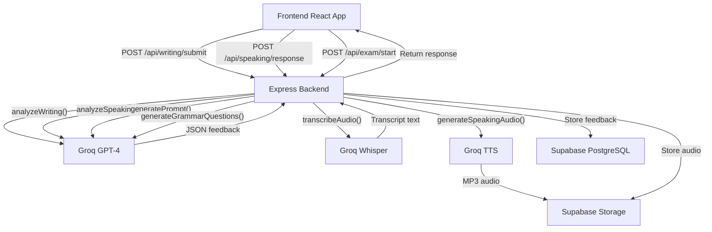
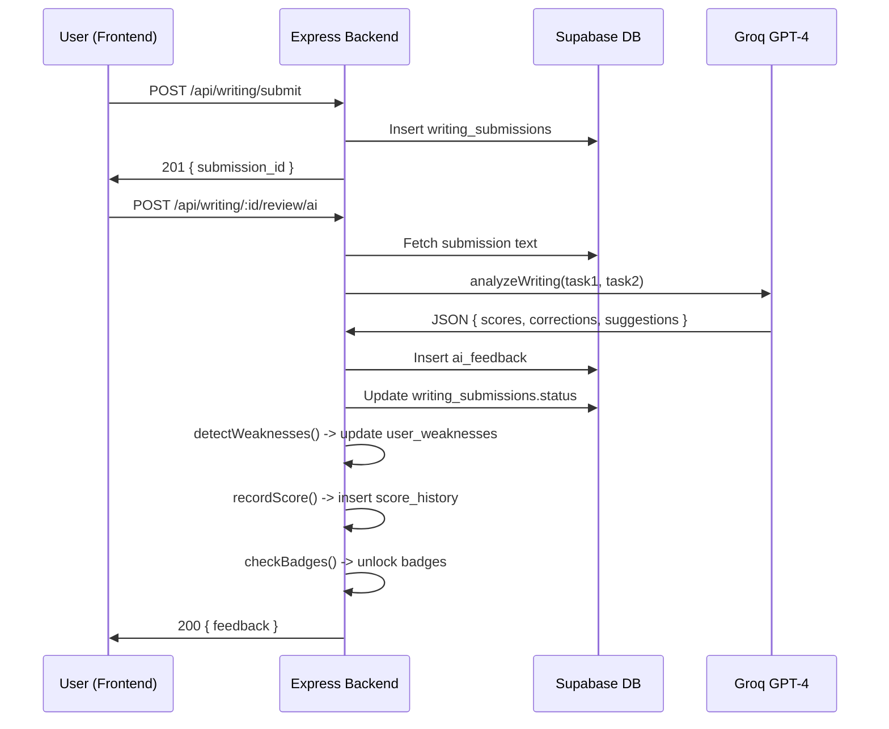
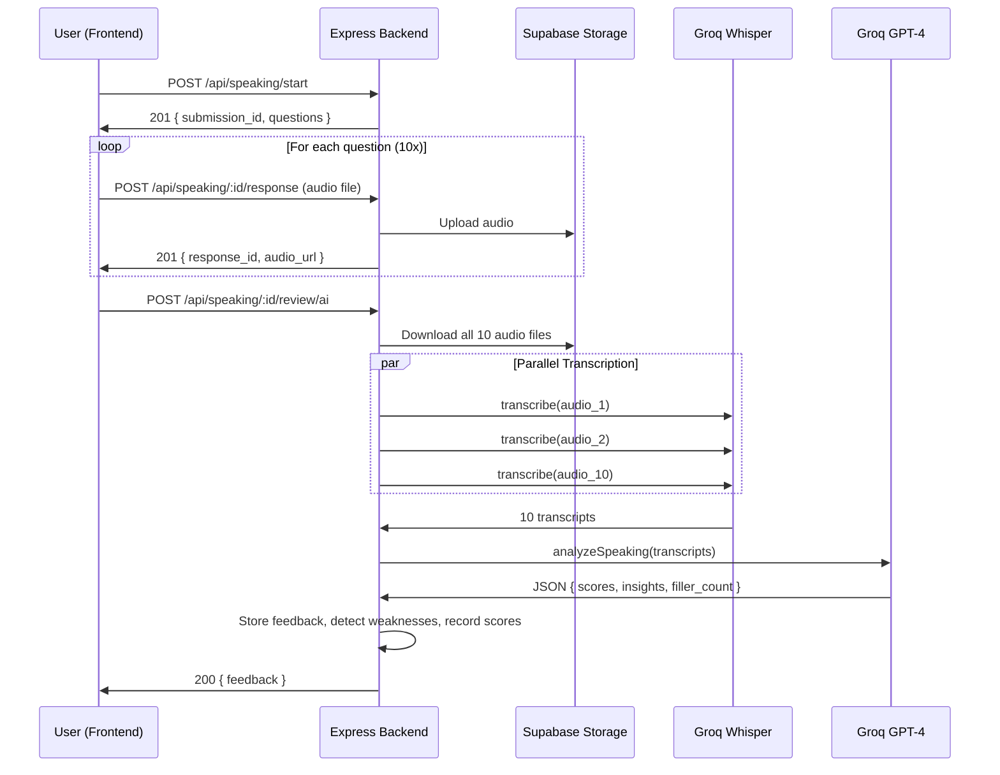

# IELTS Nexus — AI Integration Guide (Groq Services)

This document is a **complete, standalone specification** for integrating Groq services into the IELTS Nexus backend. It covers every AI touchpoint in the app, including exact prompts, API configurations, and response parsing logic.

> [!IMPORTANT]
> **All AI calls are made from the Express.js backend only.** The frontend NEVER communicates with Groq directly. The frontend sends user data (text submissions, audio file uploads) to the backend API, which then calls Groq services server-side using a secret API key. This is critical for:
> - **Security**: Groq API keys are never exposed to the browser
> - **Cost control**: Backend enforces rate limits and tier-based restrictions
> - **Reliability**: Backend can retry failed AI calls, queue expensive operations, and cache results

---

## Table of Contents

1. [Overview of AI Services Used](#1-overview-of-ai-services-used)
2. [Groq Client Setup](#2-groq-client-setup)
3. [Writing Feedback (GPT-4)](#3-writing-feedback-llama-3.3-70b-versatile)
4. [Speaking Transcription (Whisper)](#4-speaking-transcription-whisper)
5. [Speaking Analysis (GPT-4)](#5-speaking-analysis-llama-3.3-70b-versatile)
6. [Exam Question Generation (GPT-4)](#6-exam-question-generation-llama-3.3-70b-versatile)
7. [Prompt Generation for Topics (GPT-4)](#7-prompt-generation-for-topics-llama-3.3-70b-versatile)
8. [Grammar Question Generation (GPT-4)](#8-grammar-question-generation-llama-3.3-70b-versatile)
9. [Weakness Detection (GPT-4)](#9-weakness-detection-llama-3.3-70b-versatile)
10. [Score Projection (GPT-4)](#10-score-projection-llama-3.3-70b-versatile)
11. [Speaking Question Audio (TTS)](#11-speaking-question-audio-tts)
12. [Rate Limiting & Cost Management](#12-rate-limiting--cost-management)
13. [Error Handling](#13-error-handling)
14. [Service Architecture](#14-service-architecture)

---

## 1. Overview of AI Services Used

| Feature | Groq Service | Model | Purpose |
|---|---|---|---|
| Writing feedback | Chat Completions | `llama-3.3-70b-versatile` / `llama-3.3-70b-versatile` | Grade essays, find errors, suggest improvements |
| Speaking transcription | Audio Transcription | `whisper-large-v3` | Convert audio recordings to text |
| Speaking analysis | Chat Completions | `llama-3.3-70b-versatile` / `llama-3.3-70b-versatile` | Analyze transcribed speech for fluency, pronunciation hints, grammar |
| Exam question generation | Chat Completions | `llama-3.3-70b-versatile` / `llama-3.3-70b-versatile` | Generate listening/reading passages and questions |
| Topic prompt generation | Chat Completions | `llama-3.3-70b-versatile` / `llama-3.3-70b-versatile` | Create writing/speaking prompts per topic |
| Grammar questions | Chat Completions | `llama-3.3-70b-versatile` / `llama-3.3-70b-versatile` | Generate grammar MCQs with explanations |
| Weakness detection | Chat Completions | `llama-3.3-70b-versatile` / `llama-3.3-70b-versatile` | Identify weaknesses from submission history |
| Score projection | Chat Completions | `llama-3.3-70b-versatile` / `llama-3.3-70b-versatile` | Predict future band score from trends |
| Speaking question audio | Text-to-Speech | `tts-1` / `tts-1-hd` | Read speaking questions aloud |

**Estimated Cost Per User Action:**

| Action | Estimated Token Usage | Approx. Cost |
|---|---|---|
| Writing AI review | ~3,000–5,000 tokens | ~$0.03–$0.06 |
| Speaking AI review (10 questions) | ~2,000 transcription + ~3,000 analysis | ~$0.05–$0.08 |
| Full exam AI review | ~10,000 tokens total | ~$0.10–$0.15 |
| Prompt generation | ~500 tokens | ~$0.005 |
| Grammar question generation (5 questions) | ~1,000 tokens | ~$0.01 |

---

## 2. Groq Client Setup

**File: `src/config/groq.ts`**

```typescript
import Groq from 'groq-sdk';

export const groq = new Groq({
  apiKey: process.env.GROQ_API_KEY,
});

export const MODELS = {
  CHAT: process.env.GROQ_MODEL || 'llama-3.3-70b-versatile',
  WHISPER: process.env.GROQ_WHISPER_MODEL || 'whisper-large-v3',
  TTS: process.env.GROQ_TTS_MODEL || 'tts-1',
};
```

---

## 3. Writing Feedback (GPT-4)

### When Called
After user submits a writing test and selects "AI Review" in the Review Choice Modal.

### Implementation

**File: `src/services/aiService.ts`**

```typescript
interface WritingFeedback {
  overall_score: number;
  task_achievement: number;
  coherence_cohesion: number;
  lexical_resource: number;
  grammatical_range: number;
  corrections: Array<{
    original: string;
    correction: string;
    type: 'grammar' | 'spelling' | 'punctuation' | 'word_choice';
    explanation: string;
    paragraph: number;
  }>;
  cohesion_issues: Array<{
    location: string;
    issue: string;
    suggestion: string;
  }>;
  vocabulary_highlights: Array<{
    word: string;
    type: 'advanced' | 'academic' | 'idiomatic';
  }>;
  suggestions: Array<{
    text: string;
    priority: 'high' | 'medium' | 'low';
  }>;
}

export async function analyzeWriting(
  task1Prompt: string,
  task1Text: string,
  task2Prompt: string,
  task2Text: string
): Promise<WritingFeedback> {
  const response = await groq.chat.completions.create({
    model: MODELS.CHAT,
    temperature: 0.3,
    response_format: { type: 'json_object' },
    messages: [
      {
        role: 'system',
        content: WRITING_SYSTEM_PROMPT,
      },
      {
        role: 'user',
        content: `## Task 1 Prompt
${task1Prompt}

## Task 1 Response
${task1Text}

## Task 2 Prompt
${task2Prompt}

## Task 2 Response
${task2Text}`,
      },
    ],
  });

  return JSON.parse(response.choices[0].message.content!);
}
```

### System Prompt

```
const WRITING_SYSTEM_PROMPT = `You are a certified IELTS examiner with 15+ years of experience. Your job is to evaluate IELTS Academic Writing submissions (Task 1 and Task 2) and provide detailed, actionable feedback.

You MUST evaluate according to the official IELTS Writing Band Descriptors across four criteria:
1. Task Achievement (Task 1) / Task Response (Task 2)
2. Coherence and Cohesion
3. Lexical Resource
4. Grammatical Range and Accuracy

For each criterion, assign a band score from 0.0 to 9.0 in 0.5 increments.

You MUST respond in JSON format with this exact structure:
{
  "overall_score": 6.5,
  "task_achievement": 6.0,
  "coherence_cohesion": 7.0,
  "lexical_resource": 7.0,
  "grammatical_range": 6.0,
  "corrections": [
    {
      "original": "believes",
      "correction": "believe",
      "type": "grammar",
      "explanation": "Subject-verb agreement: 'people' is plural, so the verb should be 'believe' not 'believes'",
      "paragraph": 1
    }
  ],
  "cohesion_issues": [
    {
      "location": "Between paragraph 1 and 2",
      "issue": "Abrupt transition without linking",
      "suggestion": "Add a cohesive device like 'To begin with' or 'One key approach is...'"
    }
  ],
  "vocabulary_highlights": [
    {
      "word": "significantly",
      "type": "advanced"
    }
  ],
  "suggestions": [
    {
      "text": "Vary your cohesive devices. You used 'moreover' twice. Try 'furthermore', 'in addition', or 'what is more'.",
      "priority": "high"
    }
  ]
}

Rules:
- Be precise. Find EVERY grammar, spelling, and punctuation error.
- Identify ALL instances of advanced vocabulary (Band 7+ words).
- Flag cohesion issues at the paragraph transition level.
- Overall score = average of the four criteria, rounded to nearest 0.5.
- Be encouraging but honest. A Band 6 essay should score 6, not 6.5.
- For Task 1, check if the student has addressed the key features of the visual data.
- For Task 2, check if the student has addressed all parts of the question, given a clear position, and supported it with relevant examples.`;
```

---

## 4. Speaking Transcription (Whisper)

### When Called
After user submits speaking responses — each audio file is transcribed individually.

### Implementation

```typescript
import fs from 'fs';
import path from 'path';

export async function transcribeAudio(audioFilePath: string): Promise<string> {
  const audioFile = fs.createReadStream(audioFilePath);

  const transcription = await groq.audio.transcriptions.create({
    model: MODELS.WHISPER,
    file: audioFile,
    language: 'en',
    response_format: 'verbose_json',  // includes word-level timestamps
    timestamp_granularities: ['word'],
  });

  return transcription.text;
}
```

**For Supabase Storage files:**

```typescript
import fetch from 'node-fetch';

export async function transcribeFromUrl(audioUrl: string): Promise<{
  text: string;
  duration: number;
}> {
  // Download from Supabase Storage
  const response = await fetch(audioUrl);
  const buffer = await response.buffer();

  // Write to temp file
  const tempPath = path.join('/tmp', `audio_${Date.now()}.webm`);
  fs.writeFileSync(tempPath, buffer);

  try {
    const transcription = await groq.audio.transcriptions.create({
      model: MODELS.WHISPER,
      file: fs.createReadStream(tempPath),
      language: 'en',
      response_format: 'verbose_json',
    });

    return {
      text: transcription.text,
      duration: transcription.duration || 0,
    };
  } finally {
    fs.unlinkSync(tempPath); // cleanup
  }
}
```

**Supported audio formats**: mp3, mp4, mpeg, mpga, m4a, wav, webm
**Max file size**: 25 MB

---

## 5. Speaking Analysis (GPT-4)

### When Called
After all audio files are transcribed, the combined transcripts are sent for analysis.

### Implementation

```typescript
interface SpeakingFeedback {
  overall_score: number;
  fluency_coherence: number;
  pronunciation: number;
  lexical_resource: number;
  grammatical_range: number;
  insights: Array<{
    category: 'strength' | 'warning' | 'improvement';
    title: string;
    detail: string;
  }>;
  filler_count: number;
  pronunciation_issues: Array<{
    word: string;
    issue: string;
    suggestion: string;
  }>;
}

export async function analyzeSpeaking(
  transcripts: Array<{ question: string; answer: string; duration_seconds: number }>
): Promise<SpeakingFeedback> {
  const formattedTranscripts = transcripts
    .map((t, i) => `Q${i + 1}: ${t.question}\nA${i + 1} (${t.duration_seconds}s): ${t.answer}`)
    .join('\n\n');

  const response = await groq.chat.completions.create({
    model: MODELS.CHAT,
    temperature: 0.3,
    response_format: { type: 'json_object' },
    messages: [
      {
        role: 'system',
        content: SPEAKING_SYSTEM_PROMPT,
      },
      {
        role: 'user',
        content: formattedTranscripts,
      },
    ],
  });

  return JSON.parse(response.choices[0].message.content!);
}
```

### System Prompt

```
const SPEAKING_SYSTEM_PROMPT = `You are a certified IELTS Speaking examiner. Analyze the transcribed speaking responses and evaluate them according to IELTS Speaking Band Descriptors:

1. Fluency and Coherence: natural flow, logical organization, use of discourse markers
2. Pronunciation: clarity, stress, intonation patterns (inferred from transcription patterns)
3. Lexical Resource: range and accuracy of vocabulary
4. Grammatical Range and Accuracy: variety and correctness of sentence structures

Important notes:
- The input is TRANSCRIBED text from speech. Filler words like "um", "uh", "like" indicate hesitation.
- Count ALL filler words (um, uh, like, you know, I mean) separately.
- Duration per response is provided. Ideal is 20-45 seconds. Flag very short (<10s) or very long (>60s) responses.
- Pronunciation assessment is LIMITED since you only have text. Focus on word choice patterns that suggest pronunciation awareness.

Respond in JSON:
{
  "overall_score": 6.5,
  "fluency_coherence": 7.0,
  "pronunciation": 6.5,
  "lexical_resource": 7.5,
  "grammatical_range": 6.5,
  "insights": [
    {
      "category": "strength",
      "title": "Transitional Phrases",
      "detail": "Excellent use of 'on the other hand' and 'in addition to that'"
    },
    {
      "category": "warning",
      "title": "Filler Words",
      "detail": "You said 'um' or 'uh' 8 times. Try pausing silently instead of using fillers"
    },
    {
      "category": "improvement",
      "title": "Pronunciation Focus",
      "detail": "Practice the 'th' sound in words like 'think', 'through', and 'although'"
    }
  ],
  "filler_count": 8,
  "pronunciation_issues": [
    {
      "word": "think",
      "issue": "Common 'th' sound difficulty",
      "suggestion": "Practice placing tongue between teeth for 'th' sounds"
    }
  ]
}`;
```

---

## 6. Exam Question Generation (GPT-4)

### When Called
When a user starts a Full Exam Simulation, the backend generates unique questions for each section.

### Listening Section Generation

```typescript
export async function generateListeningSection(): Promise<{
  passage_context: string;
  questions: Array<{
    number: number;
    text: string;
    options: string[];
    correct_answer: string;
  }>;
}> {
  const response = await groq.chat.completions.create({
    model: MODELS.CHAT,
    temperature: 0.7,
    response_format: { type: 'json_object' },
    messages: [
      {
        role: 'system',
        content: `You are an IELTS exam creator. Generate a Listening Section 1 scenario.

The scenario should be a conversation between two people in a real-world setting (e.g., student and administrator, customer and travel agent, tenant and landlord).

Generate 10 multiple-choice questions (A, B, or C) based on the conversation.

Respond in JSON:
{
  "passage_context": "A conversation between a student and a university administrator about course registration",
  "transcript": "Full transcript of the conversation...",
  "questions": [
    {
      "number": 1,
      "text": "What is the student's main reason for visiting?",
      "options": ["To register for courses", "To collect documents", "To request information"],
      "correct_answer": "A"
    }
  ]
}`,
      },
      {
        role: 'user',
        content: 'Generate a new Listening Section 1 with 10 questions.',
      },
    ],
  });

  return JSON.parse(response.choices[0].message.content!);
}
```

### Reading Section Generation

```typescript
export async function generateReadingSection(): Promise<{
  title: string;
  passage: string;
  questions: Array<{
    number: number;
    statement: string;
    correct_answer: 'TRUE' | 'FALSE' | 'NOT GIVEN';
  }>;
}> {
  const response = await groq.chat.completions.create({
    model: MODELS.CHAT,
    temperature: 0.7,
    response_format: { type: 'json_object' },
    messages: [
      {
        role: 'system',
        content: `You are an IELTS exam creator. Generate a Reading Passage 1 for the Academic IELTS test.

The passage should be:
- 500-700 words long
- On an academic topic (history, science, social studies)
- Written at an appropriate level for IELTS Band 6-8 students
- Factual and informative

Generate 10 True/False/Not Given questions.

Respond in JSON:
{
  "title": "The History of Writing",
  "passage": "Full passage text...",
  "questions": [
    {
      "number": 1,
      "statement": "Cuneiform was primarily used for literary purposes.",
      "correct_answer": "FALSE"
    }
  ]
}`,
      },
      {
        role: 'user',
        content: 'Generate a new Reading Passage with 10 True/False/Not Given questions.',
      },
    ],
  });

  return JSON.parse(response.choices[0].message.content!);
}
```

---

## 7. Prompt Generation for Topics (GPT-4)

### When Called
When a user selects a topic and starts a writing or speaking practice.

```typescript
interface GeneratedPrompt {
  type: 'writing_task1' | 'writing_task2' | 'speaking';
  prompt_text: string;
  chart_data?: Array<{ label: string; value: number }>;
  chart_type?: 'bar' | 'line' | 'pie';
}

export async function generatePrompt(
  topicId: string,
  type: 'writing_task1' | 'writing_task2' | 'speaking'
): Promise<GeneratedPrompt> {
  const systemPrompts = {
    writing_task1: `Generate an IELTS Writing Task 1 prompt about "${topicId}". Include:
- A description of what the chart/graph shows
- Instructions to "summarize the information by selecting and reporting the main features"
- Fictional but realistic chart data (6 data points)

Respond in JSON:
{
  "prompt_text": "The chart below shows...",
  "chart_data": [{"label": "2015", "value": 120}, ...],
  "chart_type": "bar"
}`,

    writing_task2: `Generate an IELTS Writing Task 2 essay prompt about "${topicId}". The prompt should:
- Present two contrasting views OR ask for an opinion
- Be specific enough to write 250+ words
- Match real IELTS difficulty

Respond in JSON:
{
  "prompt_text": "Some people believe that... Others think... Discuss both views and give your opinion."
}`,

    speaking: `Generate 10 IELTS Speaking Part 1 questions about "${topicId}". Questions should:
- Start simple and get progressively deeper
- Mix yes/no, open-ended, and opinion questions
- Be conversational in tone

Respond in JSON:
{
  "questions": [
    "Let's talk about ${topicId}. What do you think about...?",
    ...
  ]
}`,
  };

  const response = await groq.chat.completions.create({
    model: MODELS.CHAT,
    temperature: 0.8,
    response_format: { type: 'json_object' },
    messages: [
      { role: 'system', content: systemPrompts[type] },
      { role: 'user', content: `Generate a ${type} prompt for the topic: ${topicId}` },
    ],
  });

  return JSON.parse(response.choices[0].message.content!);
}
```

---

## 8. Grammar Question Generation (GPT-4)

### When Called
When a grammar practice session starts. AI generates questions based on the user's identified weaknesses.

```typescript
export async function generateGrammarQuestions(
  category: string,
  count: number = 5,
  difficulty: string = 'medium'
): Promise<Array<{
  sentence: string;
  options: string[];
  correct_answer_index: number;
  explanation: string;
}>> {
  const response = await groq.chat.completions.create({
    model: MODELS.CHAT,
    temperature: 0.7,
    response_format: { type: 'json_object' },
    messages: [
      {
        role: 'system',
        content: `You are an English grammar expert creating practice questions for IELTS students.

Generate ${count} multiple-choice grammar questions focused on: "${category}"
Difficulty level: ${difficulty}

Each question should:
- Have a sentence with a blank (use _____ for the blank)
- Have exactly 4 options
- Have a clear correct answer
- Include a concise explanation of WHY the answer is correct

Respond in JSON:
{
  "questions": [
    {
      "sentence": "The team _____ working hard to meet the deadline.",
      "options": ["is", "are", "was", "were"],
      "correct_answer_index": 0,
      "explanation": "Use 'is' because 'team' is a collective noun treated as singular when acting as a unit."
    }
  ]
}`,
      },
      {
        role: 'user',
        content: `Generate ${count} ${difficulty} questions about ${category}`,
      },
    ],
  });

  return JSON.parse(response.choices[0].message.content!).questions;
}
```

---

## 9. Weakness Detection (GPT-4)

### When Called
After each AI review (writing or speaking), the system analyzes the feedback to detect/update user weaknesses.

```typescript
export async function detectWeaknesses(
  feedbackHistory: Array<{
    type: string;
    corrections: any[];
    scores: any;
  }>,
  existingWeaknesses: string[]
): Promise<Array<{
  title: string;
  category: string;
  severity: 'low' | 'medium' | 'high';
}>> {
  const response = await groq.chat.completions.create({
    model: MODELS.CHAT,
    temperature: 0.3,
    response_format: { type: 'json_object' },
    messages: [
      {
        role: 'system',
        content: `You are an IELTS learning analytics engine. Based on the student's feedback history, identify their top weaknesses.

Consider:
- Recurring grammar errors (same type appearing in multiple submissions)
- Low sub-scores in specific criteria
- Speaking patterns (filler words, short responses)
- Time management issues

Already-identified weaknesses: ${existingWeaknesses.join(', ')}

ONLY return NEW weaknesses not already in the list, or upgrade severity of existing ones.

Respond in JSON:
{
  "weaknesses": [
    {
      "title": "Subject-Verb Agreement",
      "category": "Grammar",
      "severity": "high"
    }
  ]
}`,
      },
      {
        role: 'user',
        content: JSON.stringify(feedbackHistory),
      },
    ],
  });

  return JSON.parse(response.choices[0].message.content!).weaknesses;
}
```

---

## 10. Score Projection (GPT-4)

### When Called
On the Home screen analytics card, to show "Projected Score" based on practice trends.

```typescript
export async function projectScore(
  scoreHistory: Array<{ module: string; score: number; date: string }>,
  practiceFrequency: number, // sessions per week
  targetDate: string
): Promise<{ projected_score: number; confidence: string }> {
  const response = await groq.chat.completions.create({
    model: MODELS.CHAT,
    temperature: 0.3,
    response_format: { type: 'json_object' },
    messages: [
      {
        role: 'system',
        content: `You are an IELTS score prediction engine. Based on the student's score history and practice frequency, predict their likely band score by their target date.

Consider:
- Rate of improvement over time
- Typical IELTS improvement curves (faster at lower bands, slower at higher bands)
- Practice frequency impact
- Diminishing returns above Band 7

Respond in JSON:
{
  "projected_score": 7.5,
  "confidence": "medium",
  "reasoning": "Based on 1.5-point improvement over 3 months..."
}`,
      },
      {
        role: 'user',
        content: `Score history: ${JSON.stringify(scoreHistory)}
Practice frequency: ${practiceFrequency} sessions/week
Target date: ${targetDate}`,
      },
    ],
  });

  return JSON.parse(response.choices[0].message.content!);
}
```

---

## 11. Speaking Question Audio (TTS)

### When Called
Optionally, to read speaking questions aloud to simulate a real IELTS speaking interview.

```typescript
export async function generateSpeakingAudio(
  questionText: string
): Promise<Buffer> {
  const response = await groq.audio.speech.create({
    model: MODELS.TTS,
    voice: 'nova',  // professional female voice, good for interview simulation
    input: questionText,
    speed: 0.95,    // slightly slower for clarity
    response_format: 'mp3',
  });

  const buffer = Buffer.from(await response.arrayBuffer());
  return buffer;
}
```

**Voice Options:**
- `nova` — Recommended. Professional, clear female voice.
- `alloy` — Neutral voice.
- `shimmer` — Warm female voice.

**Usage Flow:**
1. When generating speaking questions, also generate audio for each
2. Upload audio to Supabase Storage (`speaking-question-audio` bucket)
3. Frontend plays the audio before the user records their response

---

## 12. Rate Limiting & Cost Management

### Backend Rate Limits

| Endpoint | Free Users | Premium Users |
|---|---|---|
| AI Writing Review | 1/day | 10/day |
| AI Speaking Review | 1/day | 10/day |
| Exam Simulation | 1/week | unlimited |
| Prompt Generation | 3/day | unlimited |
| Grammar Generation | 5/day | unlimited |

### Cost Optimization Strategies

1. **Cache generated content**: Store generated prompts, questions, and passages in the database. Reuse them for multiple users (randomized selection).

2. **Use `llama-3.3-70b-versatile` instead of `llama-3.3-70b-versatile`**: 3x cheaper with similar quality for our use case.

3. **Limit token output**: Set `max_tokens` on all requests:
   - Writing analysis: `max_tokens: 2000`
   - Speaking analysis: `max_tokens: 1500`
   - Question generation: `max_tokens: 3000`
   - Grammar questions: `max_tokens: 1500`

4. **Queue expensive operations**: Use a job queue (e.g., BullMQ + Redis) for AI reviews instead of synchronous processing. Return a `processing` status and use polling or WebSocket for completion.

5. **Batch Whisper calls**: For speaking tests with 10 questions, process transcriptions in parallel using `Promise.all()`.

```typescript
// Parallel transcription of all speaking responses
const transcripts = await Promise.all(
  audioUrls.map(url => transcribeFromUrl(url))
);
```

---

## 13. Error Handling

```typescript
export async function safeAICall<T>(
  aiFunction: () => Promise<T>,
  fallbackMessage: string
): Promise<{ success: boolean; data?: T; error?: string }> {
  try {
    const data = await aiFunction();
    return { success: true, data };
  } catch (error: any) {
    console.error('AI Service Error:', error);

    if (error.status === 429) {
      return { success: false, error: 'AI service rate limited. Please try again in a moment.' };
    }
    if (error.status === 503) {
      return { success: false, error: 'AI service temporarily unavailable.' };
    }
    if (error.code === 'context_length_exceeded') {
      return { success: false, error: 'Input text too long. Please shorten your response.' };
    }

    return { success: false, error: fallbackMessage };
  }
}
```

**Retry Logic:**

```typescript
export async function withRetry<T>(
  fn: () => Promise<T>,
  maxRetries: number = 3,
  delayMs: number = 1000
): Promise<T> {
  for (let attempt = 1; attempt <= maxRetries; attempt++) {
    try {
      return await fn();
    } catch (error: any) {
      if (attempt === maxRetries) throw error;
      if (error.status === 429) {
        await new Promise(r => setTimeout(r, delayMs * attempt)); // exponential backoff
      } else {
        throw error; // non-retryable
      }
    }
  }
  throw new Error('Max retries reached');
}
```

---

## 14. Service Architecture



### End-to-End Flow: Writing Review



### End-to-End Flow: Speaking Review



---

## Related Documentation

- [01-project-overview.md](./01-project-overview.md) — What the project is
- [02-database-schema.md](./02-database-schema.md) — Complete database design
- [03-backend-api.md](./03-backend-api.md) — Express.js API specification
